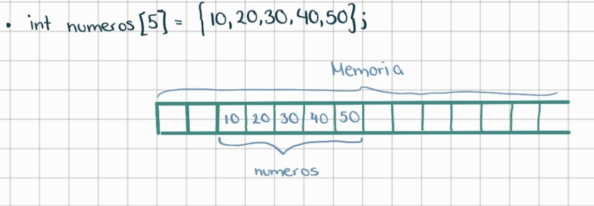
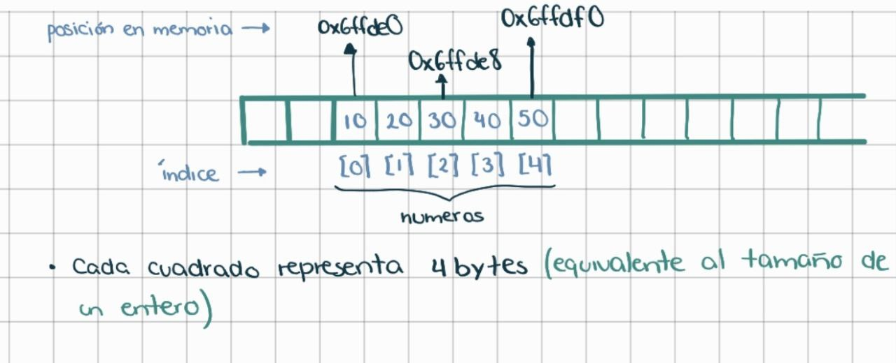

# **Arreglos**

Los **arreglos (arrays)** son estructuras de datos que consisten en un **conjunto de datos del mismo tipo**. Es decir, cuando hablamos de un arreglo de enteros, se refiere a que tenemos un conjuntos de números enteros de determinados elementos.

En **C++**, los arreglos se declaran con la siguiente sintaxis:
```
tipo_dato nombre_variable[numero_elementos];
```

Aquí un ejemplo de la declaración de un arreglo de números flotantes en **C++**.
```cpp
float precios[5] = {34.20, 76.99, 99.99, 12, 59.99};
```
*Cuando declaramos a un arreglo, normalmente se usa un nombre en **plural**, ya que un arreglo contiene varios elementos.*

**Dato importante: Cuando declaramos un arreglo, cada uno de los elementos del arreglo son almacenados en la memoria de manera contigua.** 

A continuación, se presenta gráficamente como se almacenan en memoria los datos del arreglo.

```cpp
int numeros[5] = {10, 20, 30, 40 ,50};
```



Si nos ponemos mas estrictos, se muestra el índice y la posición en memoria.


